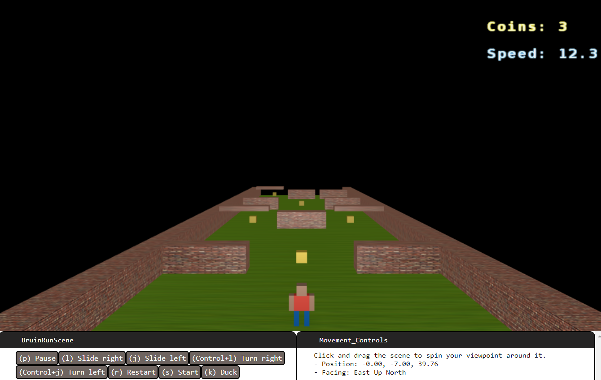
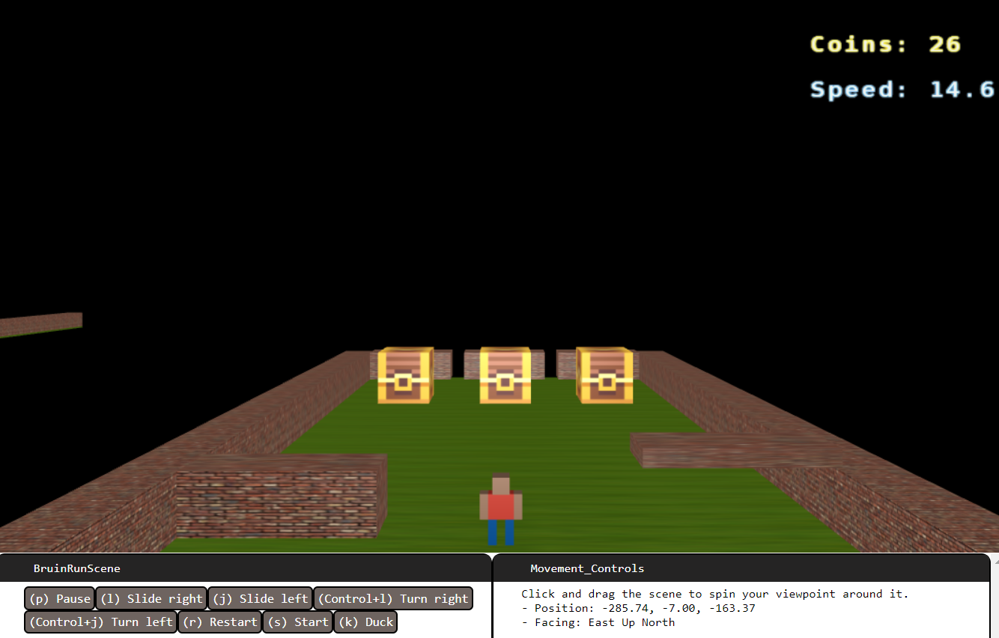

# Final project overview: Bruin Temple Run
This is our final project for CS174a taught by Professor Law. It is based on the mobile game Temple Run.

### Contributors
- Brendan Rossmango
- Natalia Luzuriaga
- Ishnoor Singh

## Introduction

Bruin Temple Run is a 3D running game where the player runs foward to reach the treasure chests, avoiding obstacles and collecting coins along the way. The player must slide left and right to avoid ground obstacles and duck underneath overhead obstacles, while also turning left and right when there are turns. Each coin a player collects increases the player's speed by a small amount. The player must also be careful to not run into the walls on the sides of the path.

If the player reaches the tresure chests, the game is over and the player wins; if the player runs into any obstacle, the player is defeated and can restart.

### Running the game

- MacOS: `./host.command`
- Windows: `host.bat`  
Then, open your browser and go to `http://localhost:8000`

### Playing the game
- Press s to start
- To slide left/right: keys 'j', 'l'
- To duck/unduck: key 'k'
- To turn left/right: keys 'Control+j', 'Control+l'
- To pause, restart: keys 'p', 'r'
- On the top right of the screen, the player's coin count and speed are displayed
- To collect coins and increase your speed, collect coins
- Do not run into any brick walls, as you will lose the game
- Run into the treasure chests to win the game

### Advanced feature: collision detection
To check if the player runs into an object (side wall, ground obstacle, overhead obstacle), we implement collision detection.
To implement collision detection, we track the coordinates of the player and the centers and dimensions (widths) of the coins and obstacles in dictionaries. Each coin and obstacle have a key in these dictionaries; the key is the model transform of the path they are on and the distance and column location on the path.
For each object, we check if the player's coordinates are within the bounds of the object, which are tracked by the object's centers and dimensions. If the player is within any object, we find which object the player is colliding with using the key. This is important for the coins, as we make them disappear if they are collected, and the right coin needs to disappear when it is collected.
